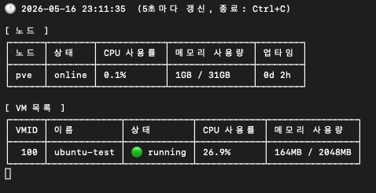

# pmon


`pmon`은 터미널에서 Proxmox 서버 상태를 확인하고 QEMU 가상 머신을 제어할 수 있는 CLI 도구입니다.

포트폴리오 프로젝트이면서, 개인 Proxmox 홈서버를 더 편하게 모니터링하고 관리하기 위해 만든 실제 사용 목적의 도구입니다.

## 주요 기능

- Proxmox 노드 상태 조회: CPU 사용률, 메모리 사용량, 업타임 표시
- 설정된 노드의 전체 VM 목록 조회
- 🟢/🔴 VM 실행 상태를 직관적인 아이콘으로 표시
- 터미널에서 VM 시작 및 중지
- `yes/no` 확인 후 VM 삭제
- 5초마다 노드와 VM 상태를 자동 갱신하는 watch 모드
- Proxmox REST API와 API Token 기반으로 직접 연동

## 스크린샷



## 기술 스택

- **Go 1.26**
- **Cobra**: CLI 명령 구조 구성
- **go-pretty**: 터미널 테이블 출력
- **godotenv**: `.env` 기반 환경변수 로딩
- **Proxmox REST API**: 별도 SDK 없이 직접 연동

## 실행 조건

- Go 1.26 이상
- 실행 중인 Proxmox 서버
- Proxmox API Token
- Proxmox 접속 정보를 담은 `.env` 파일

## 설치 방법

저장소를 클론합니다.

```bash
git clone https://github.com/naerrow/proxmox-monitor-cli.git
cd proxmox-monitor-cli
```

CLI 바이너리를 빌드합니다.

```bash
go build -o pmon .
```

환경변수 파일을 생성합니다.

```bash
cp .env.example .env
```

`.env` 파일에 Proxmox 서버 정보를 입력합니다.
.env.example 파일 참고


CLI를 실행합니다.

```bash
./pmon nodes
```

전역 명령처럼 사용하고 싶다면 바이너리를 `PATH`에 포함된 경로로 이동할 수 있습니다.

```bash
sudo mv pmon /usr/local/bin/pmon
pmon nodes
```

## 사용 방법

### 노드 목록 조회

Proxmox 노드의 CPU 사용률, 메모리 사용량, 업타임을 확인합니다.

```bash
pmon nodes
```

### VM 목록 조회

`.env`에 설정된 Proxmox 노드의 QEMU VM 목록을 확인합니다.

```bash
pmon vms
```

VM 상태는 다음과 같이 표시됩니다.

```text
🟢 running
🔴 stopped
```

### VM 시작

```bash
pmon vm start 100
```

### VM 중지

```bash
pmon vm stop 100
```

### VM 삭제

```bash
pmon vm delete 100
```

VM 삭제는 실수 방지를 위해 확인 입력이 필요합니다.

```text
yes를 입력해야 VM이 삭제됩니다.
```

### Watch 모드

노드와 VM 상태를 5초마다 자동으로 갱신합니다.

```bash
pmon watch
```

`Ctrl+C`로 watch 모드를 종료할 수 있습니다.

## 명령어

| 명령어 | 설명 |
| --- | --- |
| `pmon nodes` | Proxmox 노드 목록, CPU, 메모리, 업타임 조회 |
| `pmon vms` | 설정된 노드의 전체 VM 목록 조회 |
| `pmon vm start [vmid]` | VM 시작 |
| `pmon vm stop [vmid]` | VM 중지 |
| `pmon vm delete [vmid]` | 확인 입력 후 VM 삭제 |
| `pmon watch` | 5초마다 노드와 VM 상태 자동 갱신 |

## 환경 설정

`pmon`은 환경변수에서 Proxmox 접속 정보를 읽습니다. 로컬 개발 환경에서는 `.env` 파일에 값을 설정하면 됩니다.

| 변수 | 필수 | 설명 |
| --- | --- | --- |
| `PROXMOX_URL` | 예 | Proxmox 서버 URL. 보통 `8006` 포트를 사용합니다. |
| `PROXMOX_TOKEN` | 예 | `user@realm!token-id=secret` 형식의 Proxmox API Token |
| `PROXMOX_NODE` | 예 | VM 조회 및 제어에 사용할 Proxmox 노드 이름 |

예시: .env.example 참고

## 폴더 구조

```text
pmon/
├── main.go
├── .env.example
├── cmd/
│   ├── root.go
│   ├── nodes.go
│   ├── vms.go
│   ├── vm.go
│   └── watch.go
├── internal/
│   └── proxmox/
│       ├── client.go
│       ├── node.go
│       └── vm.go
└── config/
    └── config.go
```

## 구조

이 프로젝트는 단순하고 명확한 구조를 지향합니다.

- `cmd/`: Cobra 기반 CLI 명령과 터미널 출력 로직
- `config/`: `.env` 또는 셸 환경변수에서 Proxmox 접속 설정 로딩
- `internal/proxmox/`: Proxmox REST API 클라이언트
- `main.go`: 루트 Cobra 명령 실행

`pmon nodes`는 Proxmox `/nodes` 엔드포인트를 사용합니다. VM 목록 조회와 VM 제어 명령은 `.env`에 설정된 `PROXMOX_NODE` 기준으로 QEMU API를 호출합니다.

## 개발

전체 패키지 테스트를 실행합니다.

```bash
go test ./...
```

로컬에서 빌드합니다.

```bash
go build -o pmon .
```

빌드 없이 실행합니다.

```bash
go run . nodes
```

## 참고 사항

- 현재 VM 관련 명령은 설정된 단일 Proxmox 노드의 QEMU VM을 대상으로 동작합니다.
- CLI는 `PVEAPIToken` Authorization 헤더를 사용해 Proxmox API Token 인증을 수행합니다.
- 운영 환경에서는 필요한 권한만 가진 API Token 사용을 권장합니다.
- VM 삭제 명령은 실수 방지를 위해 수동 확인 입력을 요구합니다.

## 라이선스

이 프로젝트는 [MIT License](LICENSE)를 따릅니다.
